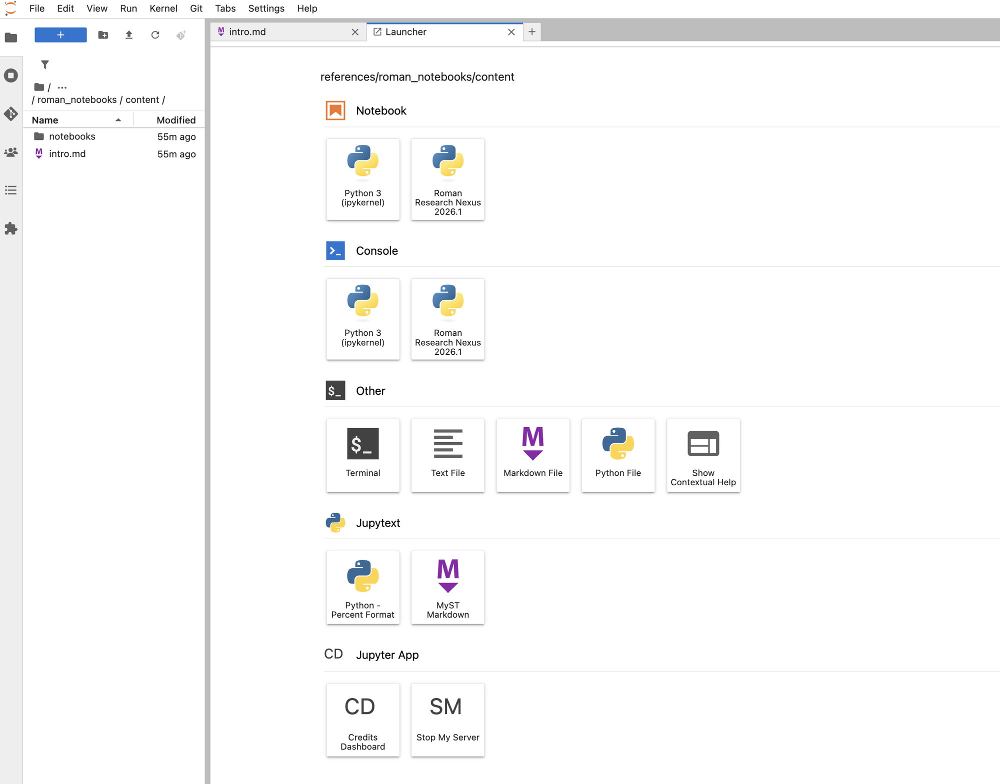

# Working on a Team

## Accessing Team Resources
When you log into the RRN, you can choose to start a session under your personal account or a team account. This determines who is billed for the compute resources (CPUs, RAM, storage) used during the session.
After launching a session, you have access to persistent home storage at:

`/home/{your-username}/`

If you belong to any teams, you can also access shared storage at:

`/teams/{team-name}/`

The names of all team directories are visible on the Nexus, but you can access their contents only if you belong to the team.

## Managing Permissions
RRN storage uses a Unix-like permission model. You may adjust file access using standard tools such as `chmod`. (For a walkthrough, see the [chmod tutorial](https://catcode.com/teachmod/index.html).)

Each team has one designated administrator who can manage permissions throughout `/teams/{team-name}/`.

The sections below describe how permissions behave for regular team members in different parts of the directory structure.

### /teams/{team-name}/

- Files or directories you create at this top level are **group-owned by the team but individually owned by you**.
- Other team members **cannot rename or delete** your files in this directory, but **can** modify their contents.
- Each file or directory retains its creator as its owner. The team administrator has broader permissions across the team directory.
- Users who are not team members **cannot** access the directory. The team administrator may grant access to non-member users when needed.

**Note**: Even the team administrator cannot delete the team directory itself.

### /teams/{team-name}/{dir}/
Team members can create subdirectories in the team folder.

By default, subdirectories are group-readable and group-writable, allowing team members to organize shared content. The creator may restrict or modify permissions if needed—for example, to prevent others from editing certain files.

**Users are responsible for managing their own permissions** and protecting files from accidental modification.

### /teams/{team-name}/{dir}/{file}
Files created inside team subdirectories are group-readable but writable only by their owners unless additional write access is granted.

## Creating New Files and Directories
By default, any file or directory you create will be owned by you as the user, with group ownership assigned to either:

- the relevant team group (if created under `/teams/{team-name}`)
- your personal group (if created under your home directory)

You may change ownership using:

- `chown` — change file owner
- `chgrp` — change group ownership

These commands can be run directly in the terminal or invoked from within scripts.

## Using a Real-Time Collaboration (RTC) Server
Teams may launch a Real-Time Collaboration (RTC) server, which provides a shared JupyterLab session that multiple team members can join at the same time. Everyone connected sees the same notebook, terminals, files, and outputs in real time.

### Launching an RTC Server
To start an RTC server:

1. Go to the **spawner page**.
2. Under your team entry (e.g., `team-imviz`), click on the **Real Time Collaboration Server** link.
3. On the RTC server spawner page, choose the **image** (e.g., `roman-17.1.1`) and the **server size** (e.g., *Small Server: 2 vCPU, 16 GB RAM*) for your RTC session.
4. Click **Start server**.

Any team member may join the running RTC session.

### Important Notes About RTC Sessions
- RTC sessions provide a **shared workspace**—all users see and edit the same files and notebooks in real time.
- **RTC does not preserve a version history of collaborative changes.** Changes made by any participant are immediately visible to everyone in the session. Teams that need to preserve earlier versions should save copies or use an external version-control system.
- Compute charges for RTC sessions are billed to the **team account**.

### When Should I Use an RTC Server?
RTC servers are useful when team members need to work together in the exact same environment. They support:

- **Live collaboration** on data analysis
- **Joint debugging** sessions
- **Training or walkthroughs** where one member demonstrates procedures to others
- **Short-term collaborative editing** requiring synchronized actions

RTC works best for **interactive, real-time collaboration**.
For independent work, version-controlled development, or long-running analysis, team members should start **non-RTC sessions** instead.

### Stopping an RTC Server
Any team member can stop an RTC server from the JupyterLab launcher by clicking **SM (Stop My Server)**. The button works for all server types, including RTC servers.

After all users log out, an idle RTC server shuts down automatically after three hours. To avoid unnecessary credit usage, teams should stop the server or ensure that all participants log out when collaborative work is complete.

---
*Last Updated: August 2026*
