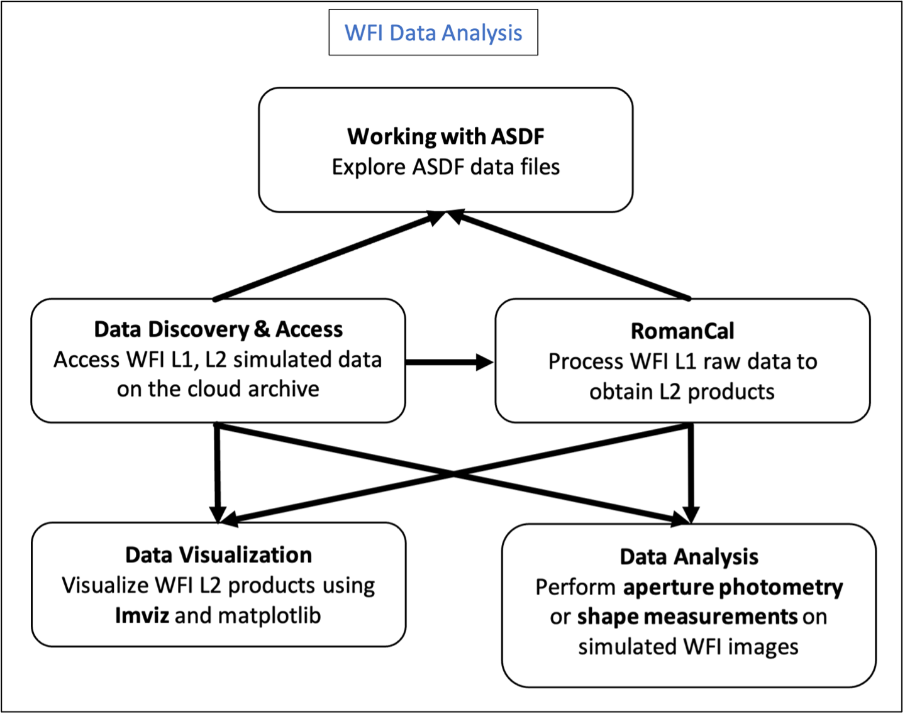

# RSP Science Workflows: WFI Data Analysis 

This workflow is designed for users that want to analyze their WFI data products for scientific purposes.

## Workflow Description

- [Access data on the RSP](../../content/notebooks/data_discovery_and_access/data_discovery_and_access.ipynb)
> Stream data from the cloud directly into memory, bypassing the need to download data locally. Learn how to download data from the STScI MAST server, which hosts data for in-flight telescopes including Hubble, TESS, and JWST, or access simulated Roman WFI data stored in AWS cloud containers.
- [Explore Roman WFI Data Files](../../content/notebooks/working_with_asdf/working_with_asdf.ipynb)
> Explore Roman WFI data products by understanding the ASDF format (Advanced Scientific Data Format). Roman WFI data products, including those generated by Roman I-sim, are saved in ASDF format. Learn how to manage ASDF files, read metadata, and access data arrays.
- [Process Roman WFI Raw Data](../../content/notebooks/romancal/romancal.ipynb)
> Process your data in RomanCal, the Roman calibration pipeline. Learn how to use RomanCal to generate L2 data from L1 raw data.
- [Visualize Roman WFI L2 Data Products](../../content/notebooks/data_visualization/data_visualization.ipynb)
> Visualize your L2 data products using Matplotlib and Imviz, a tool for visualization and analysis of 2D astronomical images based on the Jupyter platform with built-in Astropy functionality. 
- Analyze Roman WFI images
    - > Perform [forced aperture photometry](../../content/notebooks/aperture_photometry/aperture_photometry.ipynb) on a WFI image simulated with Roman I-sim. Learn how to measure the integrated fluxes for a set of specified source positions and aperture sizes.
    - > Perform [shape measurements](../../content/notebooks/measuring_galaxy_shapes/measuring_galaxy_shapes.ipynb) of astronomical sources on a WFI image simulated with Roman I-sim. Use galsim to perform ellipticity measurements, and learn how to fit a Sérsic model to a galaxy coutout.

## Additional Background Information
Additional documentation is available at the links below:
- [Roman I-Sim on readthedocs](https://romanisim.readthedocs.io/en/latest/)
- [RomanCal on readthedocs](https://roman-pipeline.readthedocs.io/en/latest/)
- [Imviz on readthedocs](https://roman-pipeline.readthedocs.io/en/latest/)

## Caveat and limitations
While the current content primarily focuses on the WFI imaging mode, Jupyter Notebook tutorials and Science Workflows for spectroscopic products will be available by Winter 2024. 