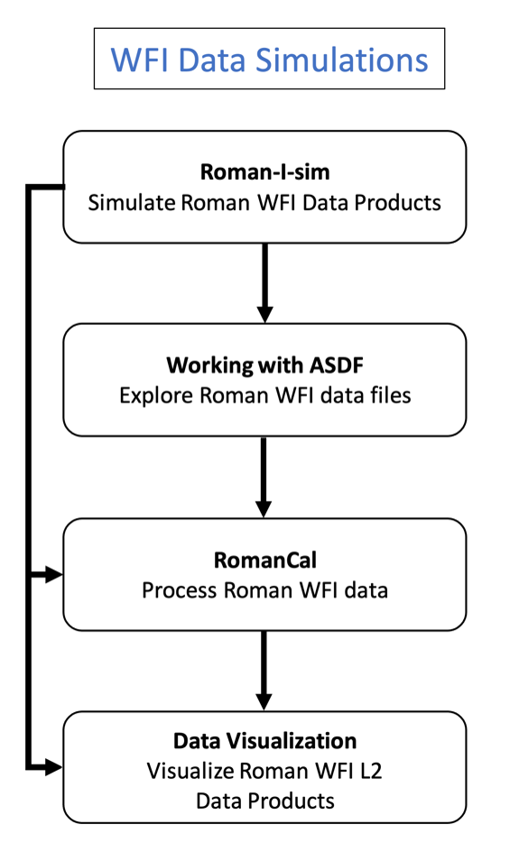

# RSP Science Workflows: WFI Data Simulations

This science workflow guides the user through the simulation, processing, manipulation, and visualization of WFI imaging data products.

## Workflow
- [Roman-I-Sim](../../content/notebooks/romanisim/romanisim.ipynb): Simulate Roman WFI Data Products
> Simulate L1 and L2 data products for your field using Roman-I-Sim, a Galsim-based simulator designed for WFI imaging data. Roman-I-Sim leverages Galsim to render astronomical scenes, WebbPSF to model the point spread function, and CRDS to access the necessary calibration information for producing realistic WFI images. You can simulate L1 and L2 data using either synthetic catalogs or the GAIA catalog. Roman-I-Sim generates outputs in the standard Roman ASDF format. To learn more about this SOC-developed and maintained software, consult [Roman-I-Sim on ReadTheDocs](https://romanisim.readthedocs.io/en/latest/).
- [Working with ASDF](../../content/notebooks/working_with_asdf/working_with_asdf.ipynb): Explore Roman WFI Data Files
> Explore your WFI data products by understanding the Advanced Scientific Data Format (ASDF). Roman WFI data products, including those generated by Roman-I-Sim, are saved in ASDF format. Learn how to manage ASDF files, read metadata, and access the data arrays. To learn more about Roman WFI data levels and products, visit the [RDox pages on the WFI data format](https://roman-docs.stsci.edu/data-handbook-home/wfi-data-format)
- [RomanCal](../../content/notebooks/romancal/romancal.ipynb): Process Roman WFI Data
> Use RomanCal, the Roman calibration pipeline, to process your data. Learn how to generate L2 data from L1 raw data obtained with Roman-I-Sim using RomanCal. To learn more about the calibration pipeline, access [RomanCal on ReadTheDocs](https://roman-pipeline.readthedocs.io/en/latest/).
- [Data Visualization](../../content/notebooks/data_visualization/data_visualization.ipynb): Visualize Roman WFI L2 Data Products
> Visualize your L2 data products using Matplotlib and Imviz, a tool for visualizing and quickly analyzing 2D astronomical images. Imviz is based on the Jupyter platform and includes built-in Astropy functionality. For additional background information, consult [Imviz documentation on ReadTheDocs](https://jdaviz.readthedocs.io/en/latest/imviz/index.html).

## Caveats and limitations
- While the current content focuses on the WFI imaging mode, Jupyter Notebook tutorials and Science Workflows for spectroscopic products will be available by Winter 2024.
- Content on Level 3 products, including mosaicked images, will be available by Winter 2024.
