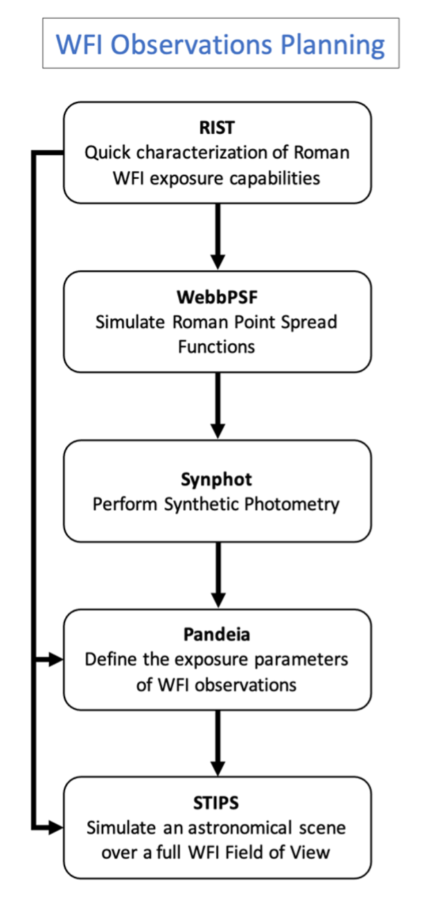

# RSP Science Workflows: WFI Observations Planning
This workflow is designed for users aiming to plan their surveys and observations by considering a number of design elements.

## Workflow description
- [Quick Characterization of Roman WFI Exposure Capabilities](../../content/notebooks/rist/rist.ipynb)
> Get a quick idea of your exposure parameters using RIST (the Roman Imager Simulation Tool). Use RIST to get an initial understanding of the expected SNR for a point source with a flat spectrum and given magnitude as a function of filter and exposure time.
- [Define the Exposure Parameters of Your WFI Observation](../../content/notebooks/pandeia/pandeia.ipynb)
> Refine your exposure parameters with Pandeia, the official exposure time calculator for the Roman Space Telescope. Simulate multiple representative sources with given characteristics (e.g., SED, extension) over a small area of a representative WFI detector and optimize your observing parameters to reach the needed SNR.
- [Simulate a Full FOV Observation with WFI](../../content/notebooks/stips/stips.ipynb)
> Create realistic simulations of your observations using STIPS (the Space Telescope Imaging Product Simulator). STIPS outputs are within 10% agreement of Pandeia simulations and use point spread functions (PSFs) generated with WebbPSF. Use STIPS to simulate a complete observation with the WFI using the observing parameters derived with Pandeia. Create a realistic astronomical scene, generate input catalogs, consider multiple pointings, and understand the effect of noise residuals.
- Detailed Characterization of WFI’s PSFs and Throughput Curves
    - > Understand the WFI performance using WebbPSF, a Python package that [simulates PSFs for the Roman Space Telescope](../../content/notebooks/webbpsf/webbpsf.ipynb) (as well as the James Webb Space Telescope). 	
    - > Use the synthetic photometry software, synphot, to [estimate the brightness of both empirical and model sources](../../content/notebooks/synphot/synphot.ipynb) as they would be measured by the WFI.

## Additional Background Information
User-facing documentation and code documentation are available at the links below: 

| Simulation Tool | User Documentation                                                                                                                            | Code Documentation                                                            |
|-----------------|-----------------------------------------------------------------------------------------------------------------------------------------------|-------------------------------------------------------------------------------|
| RIST            |                                                                                                                                               |                                                                               |
| Pandeia         | [Pandeia for Roman in RDox](https://roman-docs.stsci.edu/simulation-tools-handbook-home/pandeia-for-roman)                                    | [Pandeia on STScI Outerspace](https://outerspace.stsci.edu/display/PEN/)      |
| STIPS           | [STIPS in RDox](https://roman-docs.stsci.edu/simulation-tools-handbook-home/stips-space-telescope-imaging-product-simulator)                  | [STIPS on readthedocs](https://stsci-stips.readthedocs.io/en/stable/)         |
| WebbPSF         | [WebbPSF for Roman in RDox](https://roman-docs.stsci.edu/simulation-tools-handbook-home/webbpsf-for-roman)                                    | [WebbPSF on readthedocs](https://webbpsf.readthedocs.io/en/latest/index.html) |
| Synphot         | [stsynphot for Roman in RDox](https://roman-docs.stsci.edu/simulation-tools-handbook-home/simulation-development-utilities/synphot-for-roman) | [stsynphot on readthedocs](https://synphot.readthedocs.io/en/latest/)         |

## Caveats and Limitations
While the current content primarily focuses on the WFI imaging mode, Jupyter Notebook tutorials and Science Workflows for spectroscopic products will be available by Winter 2024.